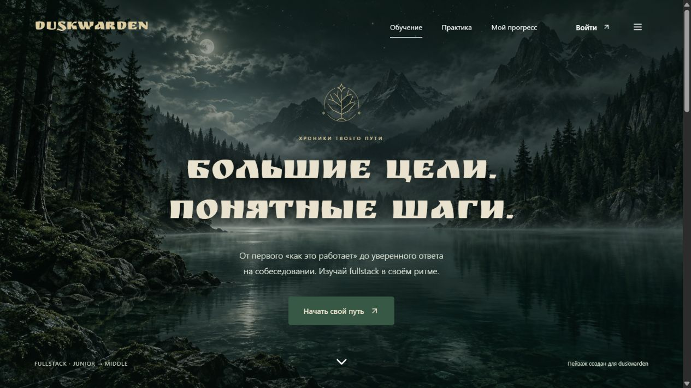

# duskwarden

[](https://github.com/VasilievNichita/interview-lab/actions/workflows/ci.yml)

**[Open the live app](https://interview-lab.interview-lab.workers.dev)**

A Russian-language fullstack theory learning app: **read → understand an example → answer questions → review mistakes → track progress**.

Built for junior interview preparation with additional middle-level tradeoffs. The curriculum expands a colleague's original `it-roadmap.html` checklist into 39 lessons across nine chapters. The original file is not redistributed; lesson explanations, interface and application code were created for this project with AI assistance.



[Mobile screenshot](docs/screenshots/mobile.jpg)

[Name and race selection](docs/screenshots/hero-profile.jpg) · [AI companion dialogue](docs/screenshots/companion.jpg) · [Mobile companion](docs/screenshots/companion-mobile.jpg)

## Features

- 39 lessons covering web fundamentals, business systems, web/desktop architecture, mobile, databases, infrastructure, observability, security and system design.
- Five explanation sections per lesson, including engineering tradeoffs and a worked exercise, plus examples, flow diagrams and primary documentation links.
- 117 questions, including 39 applied scenarios; lesson quizzes, nine chapter exams and one 39-question final exam, with answer explanations and unlimited repeats.
- Interview flashcards for spoken answers and self-assessment.
- Name + race profiles: humans, elves, orcs and dwarves; no email/password form.
- Automatically saved reading progress, best scores, mastery totals and recent attempt history. A secret transfer code restores the same profile on another device.
- Four illustrated miniature companions with an in-page NPC dialogue. Cloudflare Workers AI answers learning questions in Russian; a clearly labeled course excerpt is available when inference is unavailable.
- Guest learning and quizzes, original moonlit forest artwork, dark fantasy reading interface, water-fill hover effects, Slavic-inspired Cyrillic headings and original heraldic ornaments, keyboard access and reduced-motion support.

## Stack

React 19 · TypeScript · Vite · Cloudflare Workers · D1/SQLite · Lucide icons · Node test runner

The app has no Google Drive dependency and does not require a permanent server process in production. There are no paid external service dependencies.

## Run locally

Requirements: Node.js 22.12+ (recommended: 24), pnpm 11.19.0.

```sh
pnpm install --frozen-lockfile
pnpm build
pnpm db:local
pnpm preview
```

Open `http://localhost:8787`. Local D1 data is stored in ignored `.wrangler/` files and is separate from production. AI inference uses Cloudflare even during local development and requires an authorized account. Remove the optional `ai` binding for fully offline backend development; the mentor then returns labeled course material.

For development without Cloudflare credentials, use the isolated CI environment instead of removing bindings:

```sh
pnpm exec wrangler d1 migrations apply duskwarden-ci --local --env ci
pnpm exec wrangler dev --env ci
```

This environment has its own local database identity and no remote AI binding. It exercises the explicit course fallback. GitHub CI uses the same environment; production inference is verified separately.

For hot reload, keep Wrangler running and run `pnpm dev` in another terminal. Vite proxies `/api` to Wrangler on port 8787. For production-equivalent browser QA use the Wrangler URL after `pnpm build`.

## Tests

```sh
pnpm test
pnpm build
# With local Wrangler running:
TEST_BASE_URL=http://127.0.0.1:8787 pnpm test
```

PowerShell:

```powershell
$env:TEST_BASE_URL = 'http://127.0.0.1:8787'
pnpm test
```

Integration checks create disposable profiles **only in a localhost database** and refuse production URLs. They exercise session persistence, ownership isolation, server-side scoring, transfer/rotation, and legacy recovery. Mentor unit tests use fake AI responses and do not consume inference quota. Without `TEST_BASE_URL`, integration checks are explicitly skipped.

## Project structure

```text
src/main.tsx          Application views and interactions
src/realm.tsx         Name/race setup, transfer and companion dialogue
src/style.css        Responsive design system
src/data/            Typed lessons, questions and chapter catalog
server/index.ts      Worker routes, ownership and persistence
server/security.ts   Credential/session primitives
server/grading.ts    Server-authoritative quiz grading
server/mentor.ts     Grounded AI answers and labeled course fallback
migrations/          Versioned D1 schema
tests/               Unit and local HTTP integration checks
docs/                Architecture and deployment decisions
```

See [Architecture](docs/architecture.md), [Deployment](docs/deployment.md), [Security](SECURITY.md) and [Contributing](CONTRIBUTING.md).

## Scope and limitations

This course is a conceptual foundation based on the supplied roadmap, not a complete coding bootcamp or a claim of middle-level professional readiness. Exam scores are learning feedback, not certification. The transfer code grants access to progress: save it privately. Name alone cannot recover a profile. Losing both browser access and the code loses self-service recovery. AI answers can be wrong; course links support further reading and are not live web search results. Free Cloudflare services have quotas; availability beyond them is not guaranteed. See the security and deployment documents for details.

## License and attribution

The moonlit forest artwork was created for this project with the built-in image generation tool. Its prompt and asset details are documented in [Design](docs/design.md). The image is served locally; visitors do not contact an external image service.

Companion miniature prompts and reference provenance are documented in [Companions](docs/companions.md). The fantasy presentation is an unofficial fan-inspired design, not affiliated with Tolkien rights holders. Generated artwork and third-party character references are not covered by the code's MIT license.

MIT © 2026 [VasilievNichita](https://github.com/VasilievNichita). Lucide icons are ISC-licensed. Ruslan Display is bundled under the SIL Open Font License (see `public/fonts/OFL-RuslanDisplay.txt`). Linked documentation belongs to its respective authors; lessons use original explanations, not copied articles.
