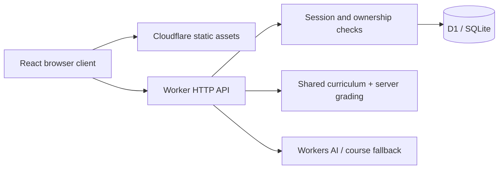

# Architecture

The application uses React + TypeScript and Vite for the interface, a single Cloudflare Worker for same-origin HTTP APIs, and D1 for durable state. No VM, container cluster, paid email provider, third-party authentication service or Google Drive integration is needed.

## Why a modular monolith

One deployable Worker keeps identity, grading, and progress updates together. D1 batches keep attempt history and best scores atomic. Microservices would add network failure modes without a requirement for independent teams or workloads.

## Data model

| Table         | Responsibility                                                             |
| ------------- | -------------------------------------------------------------------------- |
| `users`       | Name, race, transfer digest; compatibility email/password fields           |
| `sessions`    | Hashed bearer session tokens with expiration                               |
| `progress`    | Per-user/per-scope best result, attempt count and lesson reading timestamp |
| `attempts`    | Immutable assessment summaries for recent history                          |
| `rate_limits` | Atomic fixed-window authentication/assessment counters                     |

`progress.lesson_id` holds a stable lesson ID, `chapter:<id>` or `final`. Only lesson rows acquire a `read_at` timestamp. A lesson is mastered after reading and achieving 80% or more. Chapter/final exams do not automatically mark lessons as read. Best scores never decrease, even after a failed repeat. Recent history is limited to 100 records per response; mastery totals use durable progress summaries, not that window.

## Request paths

| Endpoint                    | Behavior                                                                   |
| --------------------------- | -------------------------------------------------------------------------- |
| `GET /api/me`               | Current identity or null                                                   |
| `POST /api/profile`         | Create name/race profile or update current profile; new code returned once |
| `POST /api/profile/restore` | Exchange secret transfer code for a session                                |
| `POST /api/profile/key`     | Replace the current profile's transfer code                                |
| `POST /api/mentor`          | Bounded AI tutoring with selected course context, or labeled excerpts      |
| `POST /api/register`        | Register, start session, return recovery code once                         |
| `POST /api/login`           | Verify password and issue a new session                                    |
| `POST /api/recover`         | Consume code, replace password, rotate code, revoke old sessions           |
| `POST /api/logout`          | Revoke current session                                                     |
| `GET /api/progress`         | Read only the current user's state                                         |
| `POST /api/read`            | Idempotently mark a valid lesson as read                                   |
| `GET /api/quiz?scope=...`   | Public question prompts/options                                            |
| `POST /api/attempts`        | Validate all answers and grade; persist only for authenticated users       |

Static requests bypass the Worker; `/api/*` always invokes it. Hash-based navigation avoids rewriting API failures as HTML. Static `_headers` and API response headers provide matching security policy. User text is rendered by React as text, never raw HTML.

## Tradeoffs

- Public, bundled curriculum gives fast navigation and no content database cost. It also means answers are inspectable; this is intentional for learning, not high-stakes exams.
- Opaque sessions simplify logout and revocation but require a database lookup.
- The UI has no email/password form. Existing sessions/progress survive the additive race migration, and existing recovery codes work as transfer codes. The legacy password endpoints remain compatible with older clients.
- A transfer code avoids an email delivery dependency. Name/race are not secrets, and matching names never merge profiles. Losing both browser access and the saved code loses self-service recovery.
- Browser localStorage holds the transfer code for automatic restoration after cookie expiration. D1 holds only its digest. Rotating the code blocks future restores using the old code, while existing sessions continue until expiry/revocation.
- The tutor ranks public lesson excerpts by question terms and current lesson, then asks Workers AI for a Russian explanation, example and check question. Responses are rendered as plain text. Source links are further reading, not citations to a live web search. If inference is absent, fails or exceeds the app's daily budget, labeled course excerpts remain available.
- Fixed-window throttles are simple, with boundary bursts and shared-IP limitations.
- Free hosting has quotas and no promise of unlimited capacity. A service limit can interrupt saves; the UI reports errors rather than claiming successful synchronization.
- This 39-topic course follows the supplied conceptual roadmap. It is not a complete HTML/CSS/JavaScript, algorithms, or framework programming curriculum.

## Validation

Unit tests cover curriculum consistency, scoring and credential primitives. Local HTTP integration tests cover registration, login, account isolation, result persistence, score forgery, invalid answers, recovery and revocation. Browser checks cover responsive layouts and the lesson-to-quiz flow. Integration tests refuse non-local origins to keep disposable test records out of production.

Profile tests also cover identical display names, race changes, transfer across sessions and replacement of transfer keys. Mentor tests cover unavailable inference, explicit UML terminology, and grounded model inputs with a fake provider.
